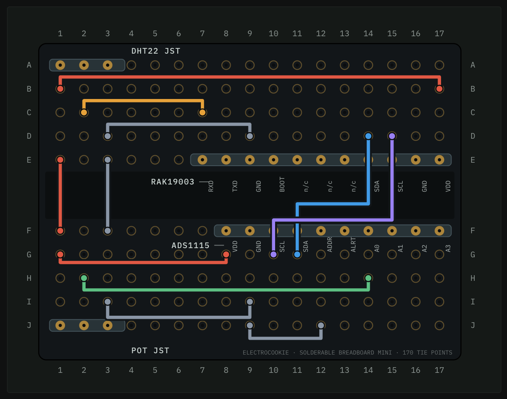

# Complete Hardware Build Walkthrough

This walkthrough reproduces the field-tested system: a battery-powered
RAK4631/RAK19003 lake node and a USB-powered Heltec V3 base station.

For the next consolidated low-power build, use the
[Lake Node Build Map](consolidated-board.md) and its
[five-page assembly PDF](artifacts/lake-node-build-map.pdf). That revision moves
the boost, shunt, filtering, connectors, and high-side MOSFET onto one
Electrocookie Large board. It is currently a build target, while the steps
below remain the validated field-prototype procedure.

## 1. Prepare the radio boards

1. Install the RAK4631 on the RAK19003 and inspect the 40-pin board-to-board
   connector for alignment before pressing it home.
2. Attach the RAK and Heltec 915 MHz antennas.
3. Leave the Li-ion battery disconnected during initial assembly.
4. Confirm both boards enumerate over USB with `pio device list`.

## 2. Place the perfboard components

Install the RAK19003 breakout, ADS1115, and two JST-XH connectors using the
coordinates in [wiring.md](wiring.md). Mark `+`, signal/return, and `−` on both
JSTs. Do not trust wire colors alone.

The image retains the prototype labels `DHT22 JST` and `POT JST`; in the
production build those connectors are respectively the **DS18B20 temperature
probe** and the **pressure assembly**. The copper/jumper topology is unchanged.

## 3. Build the 3.3 V and I²C section

With all power disconnected:

1. Connect RAK VDD to ADS1115 VDD.
2. Connect RAK GND to ADS1115 GND.
3. Connect RAK SDA/SCL to ADS1115 SDA/SCL.
4. Connect ADS1115 ADDR to ground for address `0x48`.
5. Check for shorts between 3.3 V and ground.
6. Power by USB and verify 3.3 V at the ADS1115 before continuing.

## 4. Build the temperature channel

The three probe wires are `+`, `DATA/OUT`, and `−`; determine the mapping from
the probe documentation or meter, not a generic color chart.

1. Wire top JST `A1` to RAK VDD.
2. Wire top JST `A3` to common ground.
3. Wire top JST `A2` to RAK19003 `RXD` (physical E7).
4. Install 5.1 kΩ from VDD to OUT.
5. With power removed, measure about 5.1 kΩ between `+` and `OUT`.
6. Individually insulate all three splice conductors before applying an outer
   sleeve. Shared bare splices previously collapsed the entire 3.3 V rail.

## 5. Configure the 24 V boost

1. Connect MT3608 IN+ to RAK VDD and IN− to common ground.
2. Leave OUT disconnected from every other circuit.
3. Power through USB and adjust OUT to `24.0 V` with a multimeter.
4. Power off before connecting the transmitter.

## 6. Build the pressure loop

The boost converter is inline with the three-conductor pressure-assembly JST
harness; only the two wires after the 24 V boost/return circuit connect to the
transmitter.

1. Use bottom JST `J1` and `J3` to supply 3.3 V and ground to the external
   MT3608/pressure-loop assembly.
2. Connect MT3608 OUT+ to pressure-sensor positive.
3. Connect pressure-sensor negative to the sense node.
4. Return the sense node on bottom JST `J2`; the `H2–H14` jumper carries it to
   ADS1115 A0.
5. Connect 100 Ω from the sense node to common ground.
6. Verify that ADS A0 has continuity to the shunt high side, not to 24 V.
7. Power on and expect approximately 0.377 V / 3.77 mA dry after warm-up.

## 7. Add the battery

1. Compare the battery plug polarity with the RAK19003 battery connector using
   a meter. The prototype lost a prior RAK19007 after a reversed premade lead.
2. Confirm the pack is a protected 1S Li-ion pack.
3. Connect it with USB unplugged for the first battery-only test.
4. Confirm packets continue. Battery operation may not illuminate an obvious
   LED, so use received sequence numbers as the authoritative indication.

## 8. Flash firmware

Follow [build-and-flash.md](build-and-flash.md). The active production targets
are `rak_mock_node` (legacy name, real sensor firmware) and `gateway`.

## 9. Bench acceptance

- ADS1115 reports ready at `0x48`.
- DS18B20 is found and produces no invalid-temperature flag.
- Dry pressure current settles near 3.77 mA and calibrated depth is 0 inches.
- A known shallow water column agrees within about 0.5 inch.
- The temperature probe agrees within about 1 °F after its `-5 °C` correction.
- Flags are `0x0000`, packets are acknowledged, and MQTT sequence increases.
- Battery voltage is plausible: about 4.2 V charged and never above 4.25 V.

## 10. Enclosure and water deployment

1. Use appropriately sized compression cable glands for both probe cables.
2. Do not pinch the pressure cable or its atmospheric vent in the lid. Use a
   gland for strain relief and an IP67/IP68 hydrophobic pressure-equalization
   vent in the enclosure wall.
3. Terminate the pressure vent in the dry, desiccated enclosure; never pot or
   seal the vent tube.
4. The ordered enclosure vent is [Amazon ASIN B0G1HLJVS3](https://www.amazon.com/dp/B0G1HLJVS3),
   an advertised IP68 M12 x 1.5 breather. Before drilling, confirm the delivered
   hardware includes both an O-ring and locknut and measure the actual body.
   Mount it high on a vertical wall with its face sideways or downward.
5. With the electronics removed, close the enclosure around dry paper towels
   and perform a controlled spray/leak test. Any dampness means the enclosure
   is not ready for field deployment.
6. Arrange wiring so the lid cannot press the RAK reset button or solder joints.
7. Add strain relief and desiccant; keep the electronics dry.
8. Flood the pressure cap and tighten it underwater so no air pocket blocks
   shallow pressure.
9. Fix the diaphragm at a repeatable elevation and measure water depth from it.
10. Compare the first field value with a ruler before leaving the node.

The 2026-08-22 field check measured about 16 inches manually and 15.47 inches
electronically; water temperature measured about 81 °F and reported 81.5 °F.
