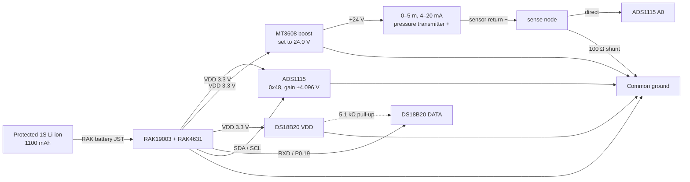

# Production Wiring — RAK19003 Lake Node

This is the wiring of the working field prototype validated on 2026-08-22. It
supersedes the earlier Heltec/Vext lake-node schematic. The **lake node is a
RAK4631 on a RAK19003 base**; the Heltec V3 is the house-side gateway.

## Electrical schematic



All grounds are common. The 24 V rail goes only to the positive pressure-sensor
lead. Never connect 24 V to the RAK, ADS1115, DS18B20, or battery connector.

## Solder-board placement

The validated Electrocookie/perfboard layout uses these coordinates:

| Part | Coordinates and pin order |
|---|---|
| ADS1115 | `F8–F17`: VDD, GND, SCL, SDA, ADDR, ALRT, A0, A1, A2, A3 |
| RAK19003 breakout | `E7–E10`: RXD, TXD, GND, BOOT; `E14–E17`: SDA, SCL, GND, VDD |
| Temperature JST-XH | Top connector: `A1=+3.3 V`, `A2=DATA`, `A3=GND` |
| Pressure-assembly JST-XH | Bottom connector: `J1=+3.3 V`, `J2=SENSE`, `J3=GND` |

The coordinates describe the prototype, but the net names—not row proximity—
are authoritative. Check every completed trace with continuity mode.

The bottom JST does **not** plug directly into the two-wire transmitter. The
MT3608 and 100 Ω shunt are wired inline in the outgoing pressure harness:

```text
board J1 (3.3 V) -> MT3608 IN+
board J3 (GND)   -> MT3608 IN- and 100 Ω shunt low side
MT3608 OUT+      -> pressure transmitter +
pressure transmitter - -> sense node
sense node       -> 100 Ω shunt high side and board J2 (ADS1115 A0)
```

## Netlist

| From | To | Notes |
|---|---|---|
| RAK `VDD` (`E17`) | ADS1115 VDD (`F8`) | Regulated 3.3 V |
| RAK `GND` (`E16` or `E9`) | ADS1115 GND (`F9`) | All grounds must have continuity |
| RAK `SCL` (`E15`) | ADS1115 SCL (`F10`) | I²C clock |
| RAK `SDA` (`E14`) | ADS1115 SDA (`F11`) | I²C data |
| ADS1115 ADDR (`F12`) | GND | Selects address `0x48` |
| ADS1115 A0 (`F14`) | Pressure-assembly JST sense (`J2`) | Direct connection through `H2–H14` jumper |
| Sense node | 100 Ω resistor | Shunt high side |
| Other side of 100 Ω | Common GND | Shunt low side |
| Pressure JST `J1` / `J3` | MT3608 IN+ / IN− | 3.3 V boost input and common ground |
| MT3608 OUT+ | Pressure sensor + | Adjust to 24.0 V before connecting sensor |
| Pressure sensor − | Sense node | Completes the 4–20 mA loop |
| Temperature JST `A1` | RAK VDD | 3.3 V |
| Temperature JST `A2` | RAK19003 `RXD` (`E7`) | Firmware: `PIN_SERIAL2_RX`, nRF P0.19 |
| Temperature JST `A3` | Common GND | Verify continuity before power-up |
| 5.1 kΩ resistor | VDD to temperature `OUT` | 1-Wire pull-up; 4.7 kΩ is also acceptable |

`TXD` is not used by production firmware. The silk-screened RAK19003 `RXD`
does **not** use the mapping initially assumed during bench testing; the working
mapping is `PIN_SERIAL2_RX` / P0.19. This was verified electrically and in the
field firmware.

## Exact jumper/net map

The following rewrites the original mock-board net map using the production
sensor names. Coordinates match the included perfboard layout image.

| Net | Connected pads/components | Soldered jumper segments |
|---|---|---|
| 3V3 | `A1` temperature +, `J1` pressure-assembly/boost +, `E17` RAK VDD, `F8` ADS VDD | `B1–B17`, `E1–F1`, `G1–G8` |
| GND | `A3` temperature −, `J3` pressure-assembly ground, `E9` RAK GND, `F9` ADS GND, `F12` ADS ADDR | `D3–D9`, `E3–F3`, `I3–I9`, `J9–J12` |
| SDA | `E14` RAK SDA, `F11` ADS SDA | `D14–G11` |
| SCL | `E15` RAK SCL, `F10` ADS SCL | `D15–G10` |
| Pressure sense | `J2` pressure sense, `F14` ADS A0 | `H2–H14` |
| Temperature data | `A2` temperature DATA, `E7` RAK RXD/P0.19 | `C2–C7` |

The RAK's second ground at `E16` is not required by this layout. Unused ADS
pins are ALRT, A1, A2, and A3. The DS18B20 pull-up is installed between the 3V3
and temperature-data nets.

## Pressure cap and vent behavior

The screw-on pressure cap trapped air during shallow-water tests and prevented
the diaphragm from seeing water pressure. Flood the cap and its cavity before
tightening it underwater. A dry trapped bubble produced the same 3.71 mA value
at 0, 5, and 6 inches; a flooded cap immediately produced the expected change.

Do not seal or pinch a pressure transmitter's atmospheric vent, if present.
Measure depth from the sensing diaphragm, not from the end of the housing.

### Vented transmitter enclosure

The pressure cable/vent must terminate in dry air at ambient atmospheric
pressure. Do not pinch it in the enclosure lid and do not make the electronics
box perfectly airtight without providing a pressure-equalization path.

Use a purpose-built **hydrophobic ePTFE enclosure vent** (often sold as an
IP67/IP68 pressure-equalization or breather vent plug) in the enclosure wall.
Bring the transmitter vent into the dry enclosure, add desiccant, and let the
enclosure breathe through that membrane. Use a separate compression cable gland
for strain relief; the gland must not crush the vented cable.

Mount the membrane vent on a sheltered vertical/downward-facing surface with a
drip loop. It equalizes air pressure while resisting liquid water, but it does
not make poor cable seals or submerged electronics acceptable. Never fill the
cable end or vent tube with epoxy, silicone, grease, or potting compound.

A sealed box is not a harmless alternative: temperature-driven pressure changes
inside it appear as false water level. One hPa of reference-pressure error is
about 1.02 cm (0.40 in) of water-head error.

## Mandatory checks before power

1. Attach 915 MHz antennas to both radios.
2. Verify the battery connector polarity against the RAK19003 marking. Premade
   JST leads are not guaranteed to have the correct polarity.
3. Confirm no continuity between battery positive and ground.
4. Confirm all intended grounds have continuity.
5. Power the MT3608 without the pressure sensor and set it to `24.0 V`.
6. Confirm the 100 Ω shunt is between the sense node and ground.
7. Confirm ADS1115 A0 never sees the 24 V rail.
8. Verify approximately 5.1 kΩ between DS18B20 VDD and DATA with power off.
9. Individually insulate every splice before placing several wires in common
   heat-shrink. The prototype previously shorted because bare splices shared one
   sleeve.
10. Use USB first; add the battery only after all rails measure correctly.

## Current limitations

- The MT3608 and pressure transmitter remain continuously powered.
- There is no MOSFET/load switch yet, so battery runtime is expected to be about
  16–24 hours from the 1100 mAh pack.
- The installed A0 connection has no optional RC input filter.
- The pressure cap must be deliberately flooded during deployment.
